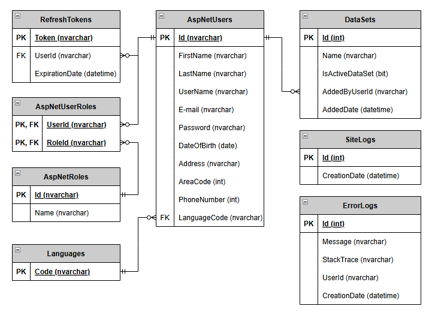
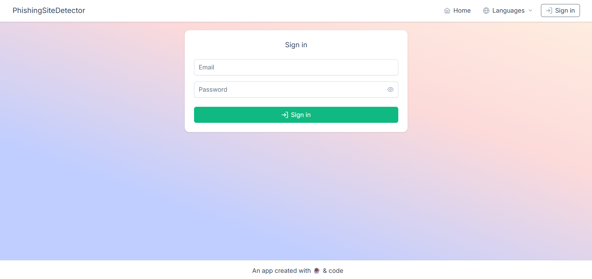
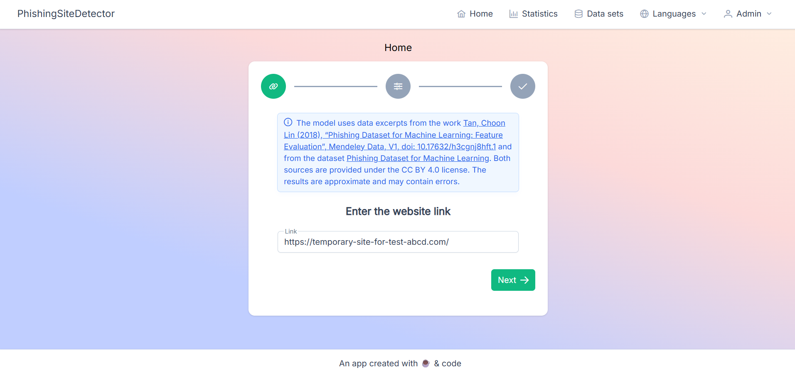
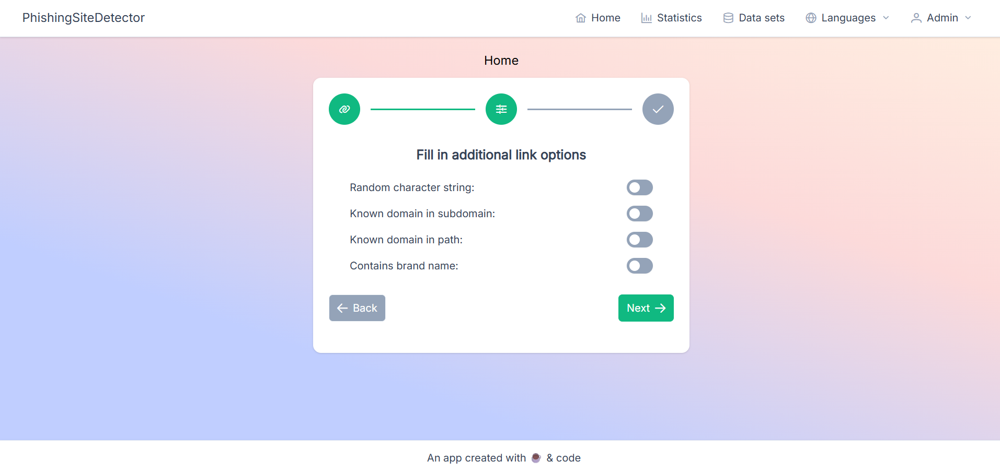
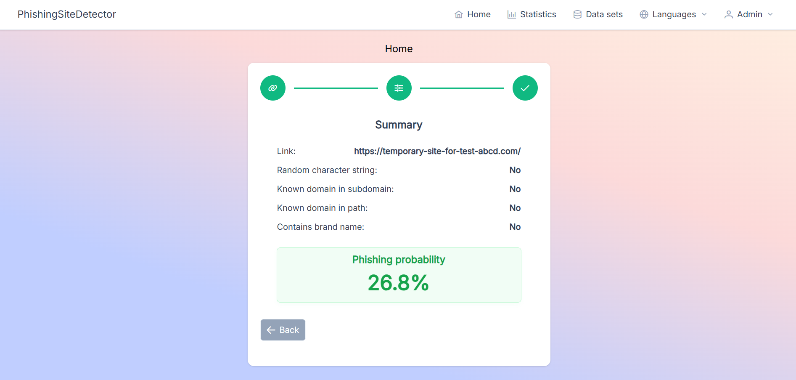
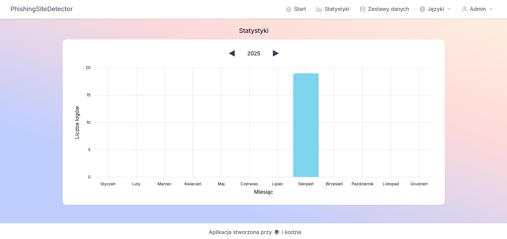
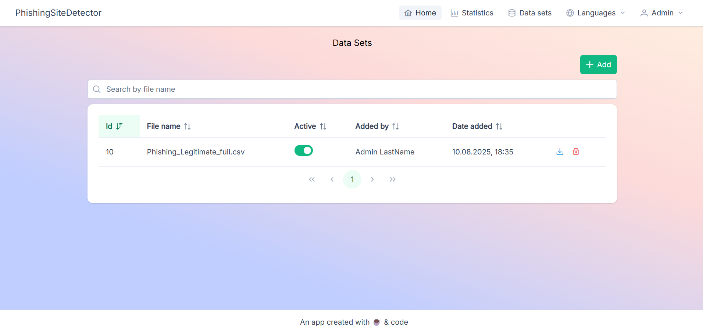
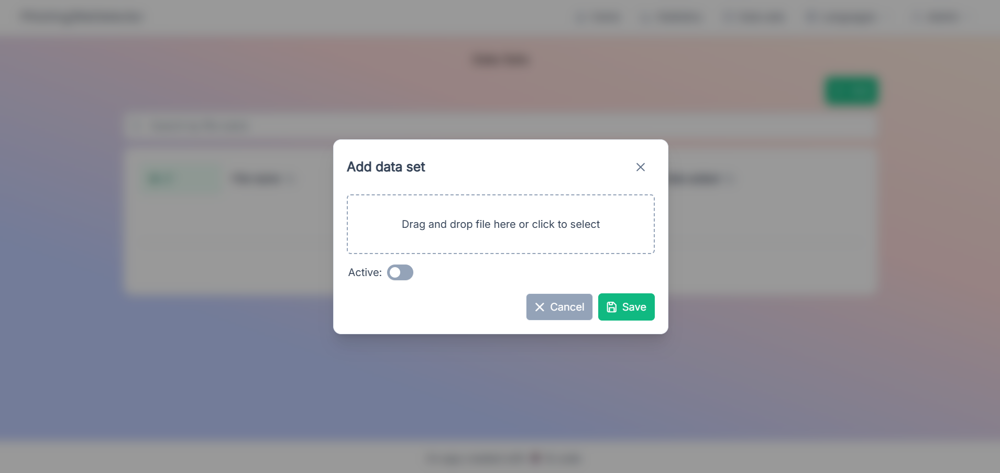
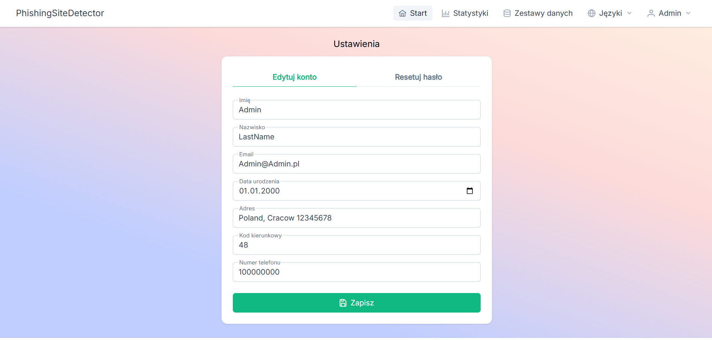
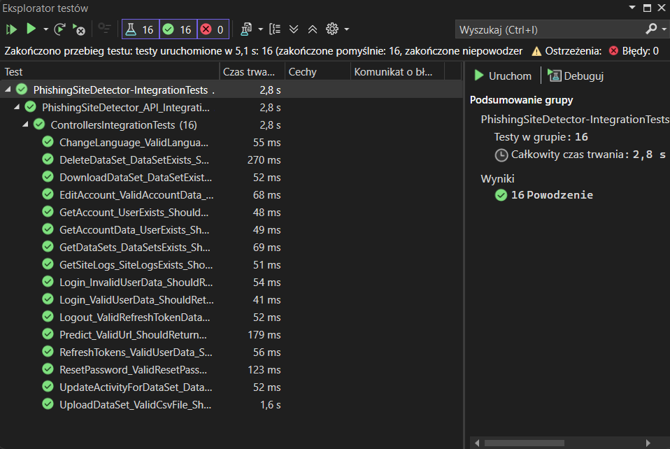

# PhishingSiteDetector

## About project
The project includes a responsive web application that supports the detection of phishing websites. A classification model was used to assign websites to a specific class based on selected input features. The model also returns a probability value, calculated based on the output layer's activation function. The application communicates with the server to exchange data and provides secure, authorized access to resources. Users can select Polish or English as the application language, adapting it to their individual needs. Key system functions include link checking, viewing statistics, managing datasets, and managing settings. Integration testing was conducted, which allowed for the detection and elimination of potential errors.

## Data source
The model uses data excerpts from the work [Tan, Choon Lin (2018), “Phishing Dataset for Machine Learning: Feature Evaluation”, Mendeley Data, V1, doi: 10.17632/h3cgnj8hft.1](https://data.mendeley.com/datasets/h3cgnj8hft/1) and Shashwat Tiwari's [Phishing Dataset for Machine Learning](https://www.kaggle.com/datasets/shashwatwork/phishing-dataset-for-machine-learning). Both sources are provided under the CC BY 4.0 license. The results are approximate and may contain errors.

## Technologies
### Web application
- Framework
    - Angular
- Languages
    - TypeScript
    - HTML
    - CSS
- Key Features
    - Machine learning (ML.NET)
    - Polish and English translation (ngx-translate)
    - Reactive Extensions (RxJS)
    - Notifications
    - Bar charts (ngx-charts)
    - Tokens stored in cookies
    - API communication
- Component library
    - PrimeNG
- Application styling
    - Tailwind CSS

### System server
- Framework
    - ASP.NET Core Web API
- Language
    - C#
- Key Features
    - REST API
    - Dependency Injection, DTO, Controller, Service and Repository patterns
    - Authentication and authorization
    - Access Token (JWT) and Refresh Token
    - LINQ
    - Application's seeder during the initial launch
    - Profile mapping using AutoMapper
- ORM:
    - Entity Framework Core
        - Migrations
- Integration tests:
    - xUnit

### Database:
- Microsoft SQL Server

## Roles in the application
- Admin
- Guest

### Database schema

## Main functions
- **Admin**:
    - Link checking
    - Statistics preview
    - Dataset management
    - Settings management
- **Guest**:
    - Logging into the system
    - Link checking

## System presentation
Login panel:

Home (1/3):

Home (2/3):

Home (3/3):

Statistics:

Data sets:

Adding a data set:

Settings:

Integration tests:

